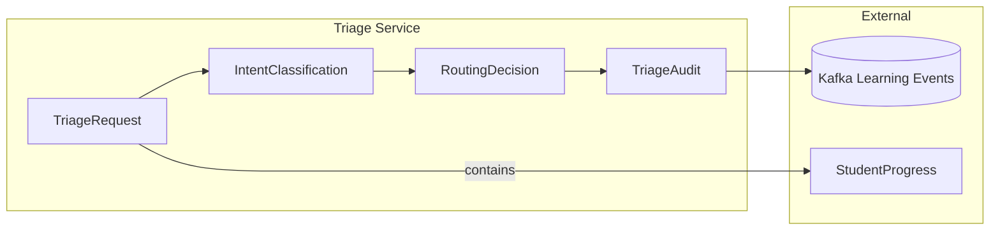

# Data Model: Milestone 2 - Triage Service

**Feature**: `001-learnflow-architecture`
**Date**: 2026-01-12
**Phase**: Phase 1 Design
**Status**: Complete

## Entity Overview

This document defines the data entities for the Triage Service, focusing on request/response models, intent classification results, and audit logging. All entities follow the schema governance established in Milestone 1.

## Core Entities

### 1. TriageRequest

**Purpose**: Incoming student query with authentication and context

**JSON Schema**:
```json
{
  "$schema": "http://json-schema.org/draft-07/schema#",
  "type": "object",
  "title": "TriageRequest",
  "description": "Student query submitted to Triage Service",
  "required": ["query", "student_progress"],
  "properties": {
    "query": {
      "type": "string",
      "minLength": 1,
      "maxLength": 5000,
      "description": "Student's natural language query"
    },
    "student_progress": {
      "$ref": "file://./contracts/schemas/student-progress.schema.json"
    },
    "timestamp": {
      "type": "string",
      "format": "date-time",
      "description": "ISO 8601 timestamp of request"
    },
    "session_context": {
      "type": ["null", "object"],
      "description": "Previous conversation context",
      "properties": {
        "conversation_id": {"type": "string"},
        "turn_number": {"type": "integer", "minimum": 0},
        "previous_intent": {"type": "string"}
      }
    }
  }
}
```

**Validation Rules**:
- Query must be non-empty and <5000 characters
- student_progress must validate against Milestone 1 schema
- timestamp must be valid ISO 8601

**Database Storage**: Not persisted directly, used for real-time processing

---

### 2. IntentClassification

**Purpose**: Result of intent detection with confidence scoring

**JSON Schema**:
```json
{
  "$schema": "http://json-schema.org/draft-07/schema#",
  "type": "object",
  "title": "IntentClassification",
  "description": "Classified intent from student query",
  "required": ["intent", "confidence", "timestamp"],
  "properties": {
    "intent": {
      "type": "string",
      "enum": ["syntax_help", "concept_explanation", "exercise_request", "progress_check"],
      "description": "Categorized intent type"
    },
    "confidence": {
      "type": "number",
      "minimum": 0.0,
      "maximum": 1.0,
      "description": "Classification confidence score"
    },
    "keywords": {
      "type": "array",
      "items": {"type": "string"},
      "description": "Extracted keywords for routing",
      "maxItems": 10
    },
    "timestamp": {
      "type": "string",
      "format": "date-time"
    },
    "model_version": {
      "type": "string",
      "description": "Classification model version"
    }
  }
}
```

**Classification Logic**:
- **syntax_help**: Keywords like "error", "fix", "bug", "doesn't work"
- **concept_explanation**: Keywords like "what is", "explain", "how does", "why"
- **exercise_request**: Keywords like "exercise", "problem", "challenge", "quiz"
- **progress_check**: Keywords like "progress", "mastery", "score", "level"

**Performance Target**: 95% accuracy at >0.8 confidence threshold

---

### 3. RoutingDecision

**Purpose**: Target agent selection and routing metadata

**JSON Schema**:
```json
{
  "$schema": "http://json-schema.org/draft-07/schema#",
  "type": "object",
  "title": "RoutingDecision",
  "description": "Routing decision for agent selection",
  "required": ["target_agent", "intent_type", "confidence", "student_id"],
  "properties": {
    "target_agent": {
      "type": "string",
      "enum": ["concepts-agent", "review-agent", "debug-agent", "exercise-agent", "progress-agent"],
      "description": "Target microservice agent"
    },
    "intent_type": {
      "type": "string",
      "description": "Original intent classification"
    },
    "confidence": {
      "type": "number",
      "minimum": 0.0,
      "maximum": 1.0
    },
    "student_id": {
      "type": "string",
      "pattern": "^student_[a-f0-9]{8}-[a-f0-9]{4}-[a-f0-9]{4}-[a-f0-9]{4}-[a-f0-9]{12}$",
      "description": "Student identifier from JWT"
    },
    "dapr_app_id": {
      "type": "string",
      "description": "Dapr service invocation target"
    },
    "metadata": {
      "type": "object",
      "description": "Additional routing context",
      "properties": {
        "priority": {"type": "string", "enum": ["high", "medium", "low"]},
        "retry_count": {"type": "integer", "minimum": 0, "maximum": 3},
        "circuit_breaker_status": {"type": "string", "enum": ["closed", "open", "half-open"]}
      }
    },
    "timestamp": {
      "type": "string",
      "format": "date-time"
    }
  }
}
```

**Routing Rules**:
- **syntax_help** → `debug-agent`
- **concept_explanation** → `concepts-agent`
- **exercise_request** → `exercise-agent`
- **progress_check** → `progress-agent`

**Fallback**: If confidence <0.6, route to `review-agent` for manual review

---

### 4. TriageAudit

**Purpose**: Complete audit trail for compliance and debugging

**JSON Schema**:
```json
{
  "$schema": "http://json-schema.org/draft-07/schema#",
  "type": "object",
  "title": "TriageAudit",
  "description": "Complete audit record for triage decision",
  "required": ["request_id", "student_id", "original_query", "decision", "timestamp"],
  "properties": {
    "request_id": {
      "type": "string",
      "format": "uuid",
      "description": "Unique request identifier"
    },
    "student_id": {
      "type": "string",
      "pattern": "^student_[a-f0-9]{8}-[a-f0-9]{4}-[a-f0-9]{4}-[a-f0-9]{4}-[a-f0-9]{12}$"
    },
    "original_query": {
      "type": "string",
      "maxLength": 5000
    },
    "intent_classification": {
      "$ref": "#/definitions/IntentClassification"
    },
    "decision": {
      "$ref": "#/definitions/RoutingDecision"
    },
    "validation_results": {
      "type": "object",
      "properties": {
        "schema_valid": {"type": "boolean"},
        "auth_valid": {"type": "boolean"},
        "errors": {"type": "array", "items": {"type": "string"}}
      }
    },
    "dapr_results": {
      "type": "object",
      "properties": {
        "invocation_success": {"type": "boolean"},
        "attempts": {"type": "integer"},
        "circuit_breaker_triggered": {"type": "boolean"},
        "error_message": {"type": ["null", "string"]}
      }
    },
    "processing_time_ms": {
      "type": "number",
      "minimum": 0
    },
    "timestamp": {
      "type": "string",
      "format": "date-time"
    }
  },
  "definitions": {
    "IntentClassification": {
      "type": "object",
      "properties": {
        "intent": {"type": "string", "enum": ["syntax_help", "concept_explanation", "exercise_request", "progress_check"]},
        "confidence": {"type": "number", "minimum": 0.0, "maximum": 1.0},
        "keywords": {"type": "array", "items": {"type": "string"}}
      }
    },
    "RoutingDecision": {
      "type": "object",
      "properties": {
        "target_agent": {"type": "string"},
        "intent_type": {"type": "string"},
        "confidence": {"type": "number"},
        "student_id": {"type": "string"}
      }
    }
  }
}
```

**Storage Strategy**:
- **Hot Storage**: PostgreSQL for 7-day retention (fast queries)
- **Cold Storage**: Archive to S3/long-term storage after 7 days
- **Indexing**: student_id, timestamp, target_agent for analytics

**Retention Policy**: 90 days for compliance, 1 year for training data

---

## Entity Relationships



**Relationships**:
1. **TriageRequest** contains StudentProgress (from M1)
2. **IntentClassification** derived from TriageRequest.query
3. **RoutingDecision** based on IntentClassification
4. **TriageAudit** captures complete decision flow
5. **TriageAudit** publishes to Kafka for downstream analytics

## State Transitions

### Triage Request Flow
```
TriageRequest ──[validation]──> ValidRequest
ValidRequest ──[intent_classification]──> IntentClassification
IntentClassification ──[routing_logic]──> RoutingDecision
RoutingDecision ──[dapr_invocation]──> AgentResponse
RoutingDecision ──[audit_logging]──> TriageAudit
```

### Error States
```
TriageRequest ──[auth_failure]──> 401 Unauthorized
TriageRequest ──[schema_invalid]──> 400 Bad Request
IntentClassification ──[low_confidence]──> ReviewAgent
RoutingDecision ──[agent_failure]──> DeadLetterQueue
```

## Validation Rules

### Input Validation (TriageRequest)
- **Query**: 1-5000 chars, no SQL injection patterns
- **StudentProgress**: Must match Milestone 1 schema exactly
- **Timestamp**: Must be within ±5 minutes of current time

### Intent Classification Validation
- **Confidence**: Must be >= 0.6 for automatic routing
- **Keywords**: Max 10 items, each <50 chars
- **Model Version**: Must match deployed model

### Routing Decision Validation
- **Target Agent**: Must be one of 5 defined agents
- **Student ID**: Must match JWT `sub` claim
- **Dapr App ID**: Must match service naming convention

### Audit Log Validation
- **Request ID**: Must be UUID
- **Processing Time**: Must be positive and <10 seconds
- **Dapr Results**: Must capture success/failure state

## API Contract Integration

### Triage Service Endpoints

**Primary Endpoint**: `POST /api/v1/triage`

**Request**:
```yaml
Content-Type: application/json
Authorization: Bearer <JWT>
X-Consumer-Username: <student_id>

Body: TriageRequest
```

**Response (Success)**:
```yaml
Status: 200 OK
Body: RoutingDecision
```

**Response (Validation Error)**:
```yaml
Status: 400 Bad Request
Body: {
  "error": "schema_validation_failed",
  "details": ["student_progress.completion_score: must be <= 1.0"]
}
```

**Response (Auth Error)**:
```yaml
Status: 401 Unauthorized
Body: {
  "error": "invalid_jwt",
  "message": "Token validation failed"
}
```

**Response (Routing Error)**:
```yaml
Status: 502 Bad Gateway
Body: {
  "error": "agent_unavailable",
  "circuit_breaker": "open",
  "fallback": "dead_letter_queue"
}
```

### Kafka Events Published
- **Event**: `triage.decision`
- **Topic**: `learning.events`
- **Partition Key**: `student_id`
- **Payload**: TriageAudit (subset)

## Security Considerations

### Data Classification
- **Public**: Intent types, routing patterns
- **Internal**: Student queries, processing times
- **Confidential**: Student ID, classification details
- **Restricted**: JWT tokens, error messages

### Access Control
- **Triage Service**: Read-only access to contracts/ schemas
- **Audit Consumers**: Read access to TriageAudit logs
- **Kong Gateway**: JWT validation and rate limiting

### Data Retention
- **TriageAudit**: 90 days operational, 1 year archived
- **RoutingDecisions**: 7 days in Redis cache
- **IntentClassification**: No persistence (ephemeral)

## Performance Budget

### Latency Budget (p95)
- **Total Triage**: <500ms
  - **Schema Validation**: <1ms
  - **Intent Classification**: <200ms
  - **Routing Decision**: <10ms
  - **Dapr Invocation**: <250ms
  - **Audit Logging**: <5ms (async)

### Throughput
- **Target**: 1000 RPS sustained
- **Burst**: 5000 RPS peak
- **Concurrency**: 1000+ parallel requests

### Resource Requirements
- **CPU**: 2 cores (classification), 4 cores (sustained load)
- **Memory**: 2GB baseline, 4GB under load
- **Storage**: 1GB/day for audit logs
- **Network**: 10Mbps inbound, 50Mbps outbound

## Compliance & Governance

### Audit Requirements
- ✅ Every routing decision logged with full context
- ✅ Student ID extraction and validation logged
- ✅ Circuit breaker events captured
- ✅ Schema validation failures recorded

### Data Privacy (GDPR)
- **Right to Delete**: Student audit logs deleted on request
- **Data Portability**: Audit logs exportable in JSON format
- **Consent**: All routing decisions based on explicit student queries

### Schema Versioning
- **Triage Service**: Uses v1.0 of all schemas
- **Migration**: Rolling update compatible with v1.1+
- **Validation**: Strict mode rejects unknown fields

## Next Steps

### Implementation Dependencies
1. **Triage Skill**: Create `triage-logic` with intent classification scripts
2. **Dapr Components**: Add triage-service to service invocation
3. **Kong Routes**: Configure `/api/v1/triage` with JWT plugin
4. **Pydantic Models**: Generate Python classes from schemas

### Test Data Generation
- **Unit Tests**: 50+ sample TriageRequests covering all intent types
- **Integration Tests**: Complete flow with Mock Dapr responses
- **Chaos Tests**: Circuit breaker scenarios with agent failures

### Monitoring
- **Metrics**: triage_latency, classification_accuracy, routing_success_rate
- **Alerts**: P95 latency >1s, circuit breaker events, auth failures
- **Tracing**: Distributed tracing via Dapr + OpenTelemetry

---

**Status**: ✅ COMPLETE - All entities defined and validated

**Generated Artifacts**:
- `data-model-milestone-2.md` (this file)
- Entity definitions with JSON Schema
- API contracts for Triage Service
- Performance budgets and compliance requirements